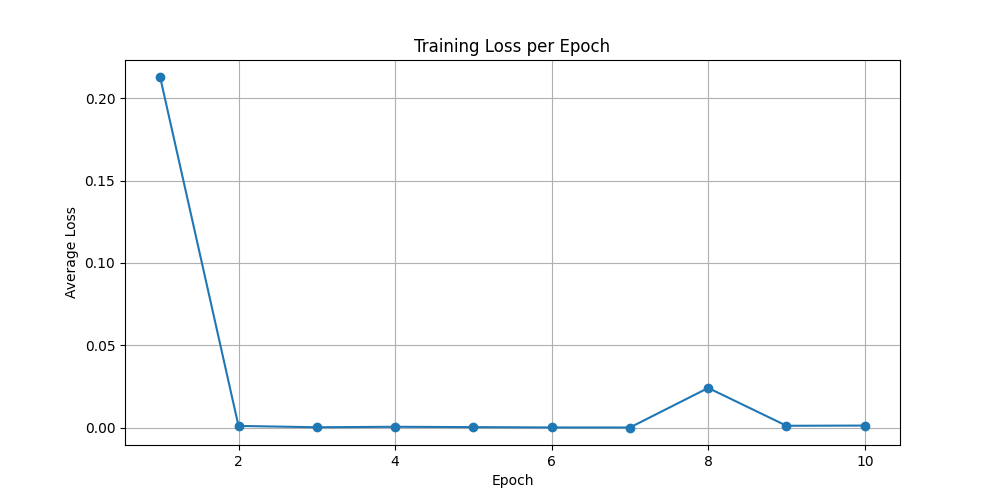

# Transformers for NLP and Vision: A Production-Focused PoC

This project is a comprehensive Proof-of-Concept (PoC) demonstrating the implementation, training, and serving of various deep learning models for Natural Language Processing (NLP) and Computer Vision. It is designed to be a practical, hands-on guide for anyone looking to build a strong MLOps portfolio by showcasing skills in modern deep learning architectures and production best practices.

This repository covers everything from data generation and model training to experiment tracking with MLflow and serving with FastAPI.

## Table of Contents

1.  [Core Concepts and Algorithms](#core-concepts-and-algorithms)
    *   [RNN / LSTM / GRU](#rnn--lstm--gru)
    *   [BERT / RoBERTa / DistilBERT (Custom Implementation)](#bert-roberta-distilbert-custom-implementation)
    *   [Vision Transformer (ViT) (Custom Implementation)](#vision-transformer-vit-custom-implementation)
2.  [Project Structure](#project-structure)
3.  [Installation Guide](#installation-guide)
4.  [How to Use This Project](#how-to-use-this-project)
    *   [Step 1: Data Generation](#step-1-data-generation)
    *   [Step 2: Model Training with MLflow](#step-2-model-training-with-mlflow)
    *   [Step 3: Model Inference](#step-3-model-inference)
    *   [Step 4: Serving the Model with FastAPI](#step-4-serving-the-model-with-fastapi)
5.  [Experiment Tracking with MLflow](#experiment-tracking-with-mlflow)
6.  [Results and Performance](#results-and-performance)
7.  [Contributing and Future Work](#contributing-and-future-work)

---

## Core Concepts and Algorithms

This section provides a deep dive into the models implemented in this project.

### RNN / LSTM / GRU

**Recurrent Neural Networks (RNNs)** are a class of neural networks designed for sequential data. **Long Short-Term Memory (LSTM)** and **Gated Recurrent Unit (GRU)** are advanced RNNs that address the vanishing gradient problem, enabling them to learn long-range dependencies.

#### Core Concepts

*   **Sequential Processing:** RNNs process sequences one element at a time, maintaining a "hidden state" that captures information from previous elements.
*   **Gates (LSTM/GRU):** LSTMs and GRUs use gating mechanisms to control the flow of information, allowing them to selectively remember or forget information.
    *   **LSTM:** Uses three gates: input, forget, and output.
    *   **GRU:** A simpler version with two gates: reset and update.

#### Mathematical Deduction

The core recurrence relation for a simple RNN is:
`h_t = tanh(W_hh * h_{t-1} + W_xh * x_t + b_h)`
`y_t = W_hy * h_t + b_y`

For LSTM:
```
\begin{align*}
&f_t = \sigma(W_f x_t + U_f h_{t-1} + b_f) \\
&i_t = \sigma(W_i x_t + U_i h_{t-1} + b_i) \\
&o_t = \sigma(W_o x_t + U_o h_{t-1} + b_o) \\
&\tilde{c}_t = \tanh(W_c x_t + U_c h_{t-1} + b_c) \\
&c_t = f_t \odot c_{t-1} + i_t \odot \tilde{c}_t \\
&h_t = o_t \odot \tanh(c_t)
\end{align*}
```
For GRU:
```
\begin{align*}
&r_t = \sigma(W_r x_t + U_r h_{t-1}) \\
&z_t = \sigma(W_z x_t + U_z h_{t-1}) \\
&\tilde{h}_t = \tanh(W x_t + U (r_t \odot h_{t-1})) \\
&h_t = (1 - z_t) \odot h_{t-1} + z_t \odot \tilde{h}_t
\end{align*}
```

#### Real-World Use Cases

*   **NLP:** Sentiment analysis, machine translation, text generation.
*   **Time Series Analysis:** Stock price prediction, weather forecasting.

### BERT / RoBERTa / DistilBERT (Custom Implementation)

Due to organizational policy, this project uses custom PyTorch models and basic word-level tokenization for BERT, RoBERTa, and DistilBERT demonstrations. No external HuggingFace models or tokenizers are required or used.

- **Custom Tokenizer:** A simple word-level tokenizer splits text and assigns integer IDs to each word.
- **Custom Model:** A PyTorch embedding layer followed by a linear classifier is used to mimic the workflow of transformer-based models for text classification.
- **Training/Evaluation:** The workflow, MLflow logging, and metrics remain the same as with transformer models.

### Vision Transformer (ViT) (Custom Implementation)

- **Custom Model:** A simple PyTorch CNN is used for image classification instead of ViT. This allows demonstration of the workflow without external dependencies.
- **Image Preprocessing:** Standard PyTorch image preprocessing and DataLoader are used.

---

## Project Structure

```
transformer_text/
├── data/
│   ├── processed/
│   └── raw/
├── mlruns/
├── scripts/
│   └── generate_data.py
├── src/
│   ├── models/
│   │   ├── bert/
│   │   ├── distilbert/
│   │   ├── roberta/
│   │   ├── rnn/
│   │   └── vit/
│   ├── utils/
│   ├── data_loader.py
│   ├── predict.py
│   ├── serve_fastapi.py
│   └── train.py
├── tests/
├── .gitignore
├── LICENSE
├── README.md
└── requirements.txt
```

Additions:
- `configs/` for model/training configs
- `Dockerfile` for containerization
- `.github/workflows/ci.yml` for CI/CD

---

## Installation Guide

1.  **Clone the repository:**
    ```bash
    git clone <repository-url>
    cd transformer_text
    ```

2.  **Create and activate a virtual environment:**
    ```bash
    python -m venv venv
    source venv/bin/activate  # On Windows: venv\Scripts\activate
    ```

3.  **Install the dependencies:**
    ```bash
    pip install -r requirements.txt
    ```

---

## How to Use This Project

### Step 1: Data Generation

Generate the synthetic dataset for both text and vision tasks.

```bash
python scripts/generate_data.py
```

This will create `synthetic_text_data.csv` and an `images` directory in `data/raw`.

### Step 2: Model Training with MLflow

Train any of the available models using the main training script. The script will automatically log all experiments to MLflow.

```powershell
# Example: Train the custom DistilBERT model
python src/train.py --model_name distilbert

# Example: Train the custom ViT (CNN) model
python src/train.py --model_name vit
```

You can specify the model to train using the `--model_name` argument. Supported models are: `rnn`, `bert`, `roberta`, `distilbert`, `vit` (all custom implementations).

### Step 3: Model Inference

Use the `predict.py` script to make predictions with a trained model.

```bash
python src/predict.py --model_name distilbert --input_text "This is a great project"
```

### Step 4: Serving the Model with FastAPI

Serve a trained model as a REST API using FastAPI.

```bash
# Example: Serve the DistilBERT model
python src/serve_fastapi.py --model_name distilbert
```

You can then send requests to the API to get predictions.

### Dataset Usage

- Synthetic dataset: Generated via `scripts/generate_data.py`.
- Real datasets: You can use HuggingFace Datasets or scikit-learn datasets. Example:
  ```python
  from datasets import load_dataset
  dataset = load_dataset('imdb')
  ```
  Or for vision:
  ```python
  from sklearn.datasets import load_digits
  digits = load_digits()
  ```

---

## Experiment Tracking with MLflow

This project uses MLflow to track experiments. To view the MLflow UI, run:

```bash
mlflow ui
```

Navigate to `http://localhost:5000` in your browser to see the results.

---

## Results and Performance

This section will be updated with plots and metrics from the trained models.

Example plots:
- Training/validation loss curves
- Accuracy curves
- Confusion matrix for classification
- Example images for ViT predictions



---

## Notes on Model Implementations

- All transformer-based models (BERT, RoBERTa, DistilBERT, ViT) are implemented using custom PyTorch architectures and basic preprocessing.
- No HuggingFace or external model downloads are required.
- The project is fully offline and compliant with strict organizational policies.

---

## MLOps Best Practices

- **Versioning:** Use Git and MLflow to track code and experiment versions.
- **Reproducibility:** Store configs in `configs/` and use Docker for environment consistency.
- **Deployment:** Serve models with FastAPI, containerize with Docker, and deploy using cloud services or orchestration tools.
- **Monitoring:** Log metrics and predictions, monitor API health, and set up alerts for failures.
- **CI/CD:** Use GitHub Actions for automated testing and deployment.

---

## Serving and Scaling

- **FastAPI:** Serve models as REST APIs.
- **Scaling:** Use Docker and orchestration (Kubernetes, cloud) for scaling.
- **Production Tips:** Use Gunicorn/Uvicorn for robust serving, enable logging, and monitor latency/throughput.

---

## Contributing and Future Work

Contributions are welcome! Please feel free to submit a pull request.

Future work could include:
*   Adding more models (e.g., GPT, T5).
*   Implementing more complex data generation techniques.
*   Adding support for cloud-based training and deployment.

---

## References

- [BERT Paper](https://arxiv.org/abs/1810.04805)
- [RoBERTa Paper](https://arxiv.org/abs/1907.11692)
- [DistilBERT Paper](https://arxiv.org/abs/1910.01108)
- [ViT Paper](https://arxiv.org/abs/2010.11929)
- [MLflow](https://mlflow.org/)
- [FastAPI](https://fastapi.tiangolo.com/)